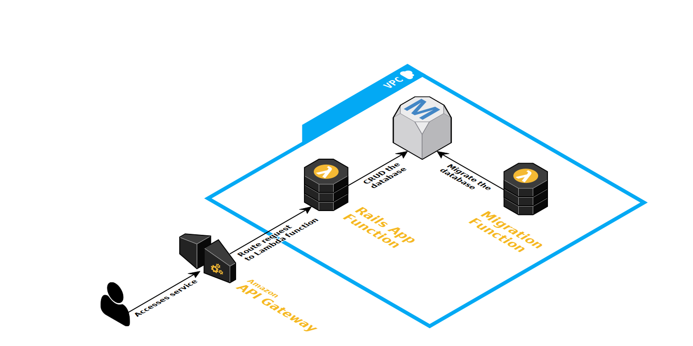

# Rails and AWS Lambda Spike
This git repository demonstrates a spike into running a simple Ruby on Rails
application on AWS Lambda

AWS SAM is used to package and deploy the application. It is scripted in `package-and-deploy.sh` and uses `template.yml` as the CloudFormation template.

The application is deployed in the following arrangement:

API Gateway receives in coming requests and routes them to the RailsLambda Function.

RailsLambda uses `lambda.rb` to start the Rails application and handle events
passed from the API Gateway. The `#handle` method translates the AWS Lambda event
messages into the format required by Rack. It is based on the `lambda.rb`
example from the sinatra demo, but some additional changes have been made to
make Rails happy.

The Rails application communicates with a RDS Postgres database.
This requires that the Lambda is deployed into the same VPC, and subnets, as the database.
The Lambda also needs an IAM role that has permission to execute inside a VPC.
All of this is configured using the CloudFormation template.

A second lambda function is also configured that can be used to run database
schema migrations. When invoked the lambda function will run the `db:create` and
`db:migrate` rake tasks. This behaviour is defined in `lambda.rb` with the
`#migration_handler` method.
